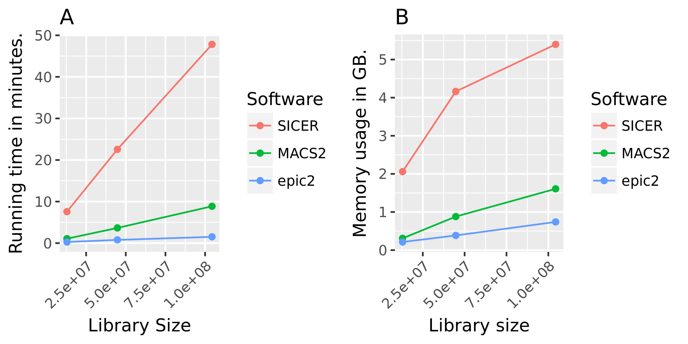

# epic2

epic2 is an ultraperformant reimplementation of SICER. It focuses on speed, low memory overhead and ease of use.

It also contains a reimplementation of the SICER-df scripts for differential enrichment.

[epic2 efficiently finds diffuse domains in ChIP-seq data (Bioinformatics, 2019)](https://doi.org/10.1093/bioinformatics/btz232)

#### Changelog

```
# 26.04.19 (0.0.33)
- use new way to compute statistics which works on large datasets (previous way available as --original-statistics)
```

#### Under active development

We are extremely responsive to bugs, issues and installation problems. We are
proud to say that epic was 20% more downloaded on PyPI than MACS2 even, and we
believe that was (among other things) because it was easy to install and use. We
wish to make epic2 similarly easy to install and use, so please report any
issues you have.


#### Features

* easy to install and use
* reads sam, single-end bam, bed and bedpe (.gz)
* extremely fast
* very low memory requirements
* works both with and without input
* metadata for ~80 UCSC genomes built in
* easily use custom genomes and assemblies with --chromsizes and --effective-genome-fraction args
* differential enrichment for WT vs. KO works with and without input (epic2-df)
* fixes two bugs in the original SICER

#### Quick Start

```
pip install epic2

epic2 --example # or -ex
# Treatment: /mnt/work/endrebak/software/anaconda/lib/python3.6/site-packages/epic2-0.0.13-py3.6-linux-x86_64.egg/epic2/examples/test.bed.gz
# Control: /mnt/work/endrebak/software/anaconda/lib/python3.6/site-packages/epic2-0.0.13-py3.6-linux-x86_64.egg/epic2/examples/control.bed.gz
# Example command: epic2 -t /mnt/work/endrebak/software/anaconda/lib/python3.6/site-packages/epic2-0.0.13-py3.6-linux-x86_64.egg/epic2/examples/test.bed.gz -c /mnt/work/endrebak/software/anaconda/lib/python3.6/site-packages/epic2-0.0.13-py3.6-linux-x86_64.egg/epic2/examples/control.bed.gz > deleteme.txt

epic2 -t /mnt/work/endrebak/software/anaconda/lib/python3.6/site-packages/epic2-0.0.13-py3.6-linux-x86_64.egg/epic2/examples/test.bed.gz \
      -c /mnt/work/endrebak/software/anaconda/lib/python3.6/site-packages/epic2-0.0.13-py3.6-linux-x86_64.egg/epic2/examples/control.bed.gz \
      > deleteme.txt

head -3 deleteme.txt
# Chromosome      Start   End     PValue  Score   Strand  ChIPCount       InputCount      FDR     log2FoldChange
# chr1    23568400        23568599        8.184732752658519e-11   1000.0  .       2       0       6.319375023267071e-10   11.307485580444336
# chr1    26401200        26401399        8.184732752658519e-11   1000.0  .       2       0       6.319375023267071e-10   11.307485580444336

epic2-df -ex
# Knockout: /mnt/work/endrebak/software/anaconda/lib/python3.6/site-packages/epic2-0.0.20-py3.6-linux-x86_64.egg/epic2/examples/test.bed.gz
# Wildtype: /mnt/work/endrebak/software/anaconda/lib/python3.6/site-packages/epic2-0.0.20-py3.6-linux-x86_64.egg/epic2/examples/control.bed.gz
# Example command: epic2-df -tk /mnt/work/endrebak/software/anaconda/lib/python3.6/site-packages/epic2-0.0.20-py3.6-linux-x86_64.egg/epic2/examples/test.bed.gz -tw /mnt/work/endrebak/software/anaconda/lib/python3.6/site-packages/epic2-0.0.20-py3.6-linux-x86_64.egg/epic2/examples/control.bed.gz -ok deleteme_ko.txt -ow deleteme_wt.txt > deleteme.txt
```

#### Install

The installation currently requires bioconda htslib to be installed for setup.py
to find the appropriate headers. I will update the install script with more ways
to include the headers.

First you need to install bioconda:

```
wget https://repo.anaconda.com/miniconda/Miniconda3-latest-Linux-x86_64.sh
bash Miniconda3-latest-Linux-x86_64.sh -b -p $HOME/miniconda
export PATH="$HOME/miniconda/bin:$PATH"
```

Linux:

```
conda install -c bioconda epic2
```

macOS:

```
pip install Cython
pip install pysam
pip install epic2
```

#### Performance




#### CLI

```
usage: epic2 [-h] --treatment TREATMENT [TREATMENT ...]
             [--control CONTROL [CONTROL ...]] [--genome GENOME]
             [--keep-duplicates] [--original-algorithm] [--bin-size BIN_SIZE]
             [--gaps-allowed GAPS_ALLOWED] [--fragment-size FRAGMENT_SIZE]
             [--false-discovery-rate-cutoff FALSE_DISCOVERY_RATE_CUTOFF]
             [--effective-genome-fraction EFFECTIVE_GENOME_FRACTION]
             [--chromsizes CHROMSIZES] [--e-value E_VALUE]
             [--required-flag REQUIRED_FLAG] [--filter-flag FILTER_FLAG]
             [--mapq MAPQ] [--autodetect-chroms]
             [--discard-chromosomes-pattern DISCARD_CHROMOSOMES_PATTERN]
             [--experimental-statistics] [--output OUTPUT] [--quiet]
             [--example] [--version]

epic2, version: 0.0.26 (Visit github.com/endrebak/epic2 for examples and help.
Run epic2-example for a simple example command.)

optional arguments:
  -h, --help            show this help message and exit
  --treatment TREATMENT [TREATMENT ...], -t TREATMENT [TREATMENT ...]
                        Treatment (pull-down) file(s) in one of these formats:
                        bed, bedpe, bed.gz, bedpe.gz or (single-end) bam, sam.
                        Mixing file formats is allowed.
  --control CONTROL [CONTROL ...], -c CONTROL [CONTROL ...]
                        Control (input) file(s) in one of these formats: bed,
                        bedpe, bed.gz, bedpe.gz or (single-end) bam, sam.
                        Mixing file formats is allowed.
  --genome GENOME, -gn GENOME
                        Which genome to analyze. Default: hg19. If
                        --chromsizes and --egf flag is given, --genome is not
                        required.
  --keep-duplicates, -kd
                        Keep reads mapping to the same position on the same
                        strand within a library. Default: False.
  --original-algorithm, -oa
                        Use the original SICER algorithm, without the epic2
                        fix. This will use all reads in your files to compute
                        the p-values, including those falling outside the
                        genome boundaries.
  --bin-size BIN_SIZE, -bin BIN_SIZE
                        Size of the windows to scan the genome. BIN-SIZE is
                        the smallest possible island. Default 200.
  --gaps-allowed GAPS_ALLOWED, -g GAPS_ALLOWED
                        This number is multiplied by the window size to
                        determine the number of gaps (ineligible windows)
                        allowed between two eligible windows. Must be an
                        integer. Default: 3.
  --fragment-size FRAGMENT_SIZE, -fs FRAGMENT_SIZE
                        (Single end reads only) Size of the sequenced
                        fragment. Each read is extended half the fragment size
                        from the 5' end. Default 150 (i.e. extend by 75).
  --false-discovery-rate-cutoff FALSE_DISCOVERY_RATE_CUTOFF, -fdr FALSE_DISCOVERY_RATE_CUTOFF
                        Remove all islands with an FDR above cutoff. Default
                        0.05.
  --effective-genome-fraction EFFECTIVE_GENOME_FRACTION, -egf EFFECTIVE_GENOME_FRACTION
                        Use a different effective genome fraction than the one
                        included in epic2. The default value depends on the
                        genome and readlength, but is a number between 0 and
                        1.
  --chromsizes CHROMSIZES, -cs CHROMSIZES
                        Set the chromosome lengths yourself in a file with two
                        columns: chromosome names and sizes. Useful to analyze
                        custom genomes, assemblies or simulated data. Only
                        chromosomes included in the file will be analyzed.
  --e-value E_VALUE, -e E_VALUE
                        The E-value controls the genome-wide error rate of
                        identified islands under the random background
                        assumption. Should be used when not using a control
                        library. Default: 1000.
  --required-flag REQUIRED_FLAG, -f REQUIRED_FLAG
                        (bam only.) Keep reads with these bits set in flag.
                        Same as `samtools view -f`. Default 0
  --filter-flag FILTER_FLAG, -F FILTER_FLAG
                        (bam only.) Discard reads with these bits set in flag.
                        Same as `samtools view -F`. Default 1540 (hex: 0x604).
                        See https://broadinstitute.github.io/picard/explain-
                        flags.html for more info.
  --mapq MAPQ, -m MAPQ  (bam only.) Discard reads with mapping quality lower
                        than this. Default 5.
  --autodetect-chroms, -a
                        (bam only.) Autodetect chromosomes from bam file. Use
                        with --discard-chromosomes flag to avoid non-canonical
                        chromosomes.
  --discard-chromosomes-pattern DISCARD_CHROMOSOMES_PATTERN, -d DISCARD_CHROMOSOMES_PATTERN
                        (bam only.) Discard reads from chromosomes matching
                        this pattern. Default '_'. Note that if you are not
                        interested in the results from non-canonical
                        chromosomes, you should ensure they are removed with
                        this flag, otherwise they will make the statistical
                        analysis too stringent.
  --experimental-statistics
                        (advanced): Use a sligthly modified way to compute the
                        statistics that avoids a bug in the original SICER on
                        large datasets. Only use if you get an error.
  --output OUTPUT, -o OUTPUT
                        File to write results to. Default: stdout.
  --quiet, -q           Do not write output messages to stderr.
  --example, -ex        Show the paths of the example data and an example
                        command.
  --version, -v         show program's version number and exit
```

#### Output

When used with a background library, epic2 produces the following bed6-compatible file:

```
Chromosome	Start	End	PValue	Score	Strand	ChIPCount	InputCount	FDR	log2FoldChange
chr1	23568400	23568599	8.184732752658519e-11	1000.0	.	2	0	6.319375023267071e-10	11.307485580444336
chr1	26401200	26401399	8.184732752658519e-11	1000.0	.	2	0	6.319375023267071e-10	11.307485580444336
...
```

This is the meaning of the columns:

| Column | Description   |
| --- | --- |
| PValue | Poisson-computed PValue based on the number of ChIP count vs. library-size normalized Input count in the region |
| Score | Log2FC * 100 (capped at 1000). Regions with a larger relative ChIP vs. Input count will show as darker in the [UCSC genome browser](https://genome.ucsc.edu/FAQ/FAQformat.html#format1) |
| ChIPCount | The number of ChIP counts in the region (also including counts from windows with a count below the cutoff) |
| InputCount | The number of Input counts in the region |
| FDR | Benjamini-Hochberg correction of the p-values |
| log2FoldChange | Log2 of the region ChIP count vs. the library-size corrected region Input count |

When used without a background library, epic2 produces the following bed6-compatible file:

```
Chromosome      Start   End     ChIPCount       Score   Strand
chr1    23568400        23568599        2       14.983145713806152      .
chr1    26401200        26401399        2       14.983145713806152      .
...
```

Here Score is merely the score the island got (SICER internal really).

#### epic2-df Output

The output from epic2-df contains one row for each region tested for differential enrichment between the two conditions:

```
Chromosome	Start	End	KO	WT	FC_KO	FC_WT	P_KO	P_WT	FDR_KO	FDR_WT
chr1	23568400	23568599	2	0	2.8140145395799676	0.3553641908862576	0.09285120415065423	1.0	0.23131352612970002	1.0
chr1	26401200	26401399	2	0	2.8140145395799676	0.3553641908862576	0.09285120415065423	1.0	0.23131352612970002	1.0
...
```

KO and WT is the number of reads from the KO and WT conditions in the region. FC_KO is just

```
scaling_factor = sum_ko / sum_wt
((KO + 1) / (WT + 1)) * scaling_factor
```

while FC_WT is

```
scaling_factor = sum_ko / sum_wt
((WT + 1) / (KO + 1)) / scaling_factor
```

so a FC_KO > 1 means that the knockout condition is overrepresented in the region.

The FDR_KO and FDR_WT tells whether the overrepresentation actually is
statistically significant after controlling for multiple testing.

#### FAQ:

- How are paired end-read handled?

Paired-end reads (bedpe format only) are handled automatically. They are turned
into a regular read by taking the leftmost end of the leftmost mate and the
rightmost end of the rightmost mate. If two intervals have these two coordinates
in common and are on the same chromosome/strand, they are considered a
duplicate. Instead of extending from the 5'-end, the midpoint is used when
counting reads in bins.

- Can I be sure that epic2 and SICER give the exact same results?

See https://github.com/endrebak/epic2_supplementaries/tree/master/workflows/show_same_results

- Can you mix the input filetypes? I.e. use bam and bed together?

Yes. However, note that the chromosomes are often named differently in bam and
bed files.

- Can epic2 read from bash process substitutions?

No. As epic2 sniffs the readlengths and file formats the lines used to do this
are lost if using process substitution. See https://unix.stackexchange.com/q/164107/26674

- How do I cite epic2?

```
# bibtex format
@article{10.1093/bioinformatics/btz232,
    author = {Sætrom, Pål and Stovner, Endre Bakken},
    title = "{epic2 efficiently finds diffuse domains in ChIP-seq data}",
    year = {2019},
    month = {03},
    abstract = "{Data from chromatin immunoprecipitation (ChIP) followed by high throughput sequencing (ChIP-seq) generally contain either narrow peaks or broad and diffusely enriched domains. The SICER ChIP-seq caller has proven adept at finding diffuse domains in ChIP-seq data, but it is slow, requires much memory, needs manual installation steps and is hard to use. epic2 is a complete rewrite of SICER that is focused on speed, low memory overhead and ease-of-use.The MIT-licensed code is available at https://github.com/biocore-ntnu/epic2}",
    doi = {10.1093/bioinformatics/btz232},
    url = {https://doi.org/10.1093/bioinformatics/btz232},
    eprint = {http://oup.prod.sis.lan/bioinformatics/advance-article-pdf/doi/10.1093/bioinformatics/btz232/28377147/btz232.pdf},
}
```
