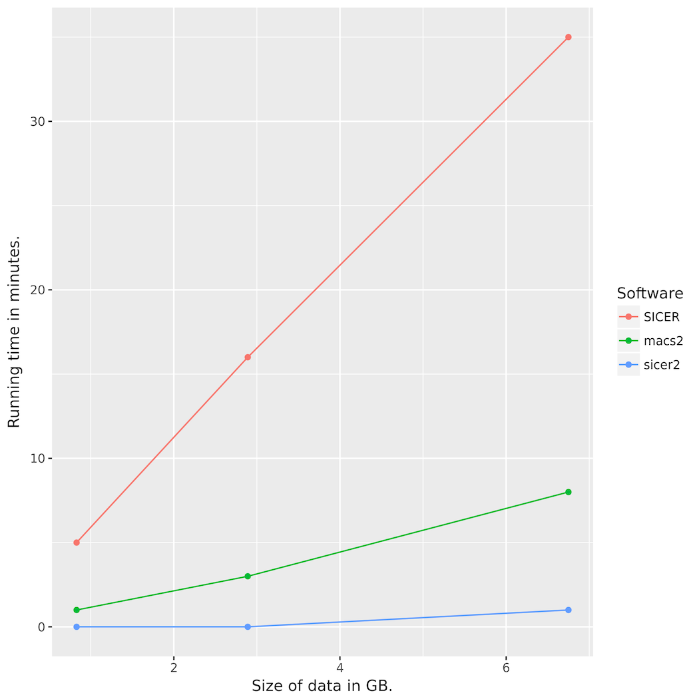
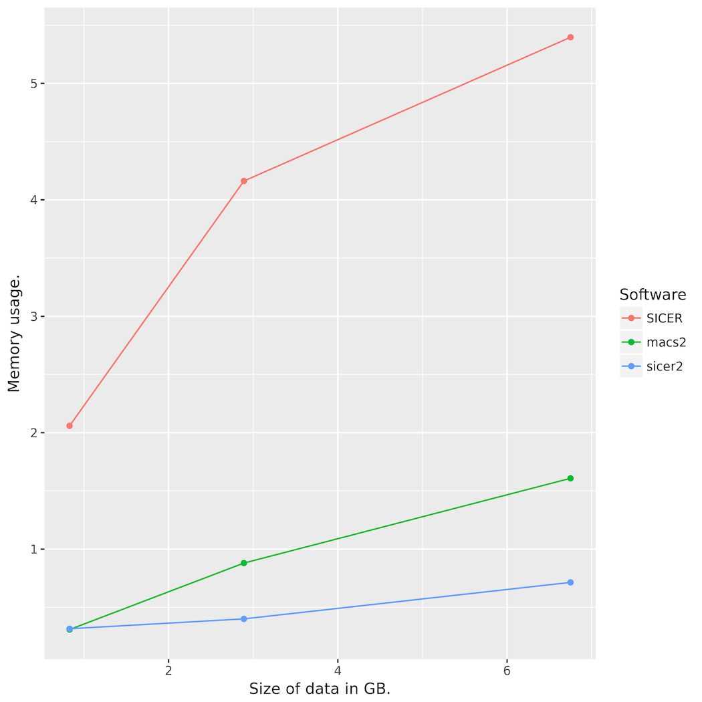

# SICER2

SICER2 is an ultraperformant reimplementation of SICER. It focuses on speed and
low memory overhead.

#### Features

* reads sam, single-end bam, bed and bedpe
* extremely fast
* low memory requirements
* works both with and without input
* metadata for ~80 UCSC genomes built in
* easily use custom genomes and assemblies with --chromsizes and --effective-genome-fraction args

#### Quick Start

```
git clone git@github.com:endrebak/SICER2.git
cd SICER2
python setup.py install
SICER2 -t examples/test.bed -c examples/control.bed > results.txt
```

#### CLI

```
usage: SICER2 [-h] --treatment TREATMENT [TREATMENT ...]
              [--control CONTROL [CONTROL ...]] [--genome GENOME]
              [--drop-duplicates] [--bin-size BIN_SIZE]
              [--gaps-allowed GAPS_ALLOWED] [--fragment-size FRAGMENT_SIZE]
              [--false-discovery-rate-cutoff FALSE_DISCOVERY_RATE_CUTOFF]
              [--effective-genome-fraction EFFECTIVE_GENOME_FRACTION]
              [--chromsizes CHROMSIZES]

SICER2. (Visit github.com/endrebak/SICER2 for examples and help.)

optional arguments:
  -h, --help            show this help message and exit
  --treatment TREATMENT [TREATMENT ...], -t TREATMENT [TREATMENT ...]
                        Treatment (pull-down) file(s) in (b/gzipped) bed/bedpe
                        format.
  --control CONTROL [CONTROL ...], -c CONTROL [CONTROL ...]
                        Control (input) file(s) in (b/gzipped) bed/bedpe
                        format.
  --genome GENOME, -gn GENOME
                        Which genome to analyze. Default: hg19. If
                        --chromsizes flag is given, --genome is not required.
  --drop-duplicates, -d
                        Keep reads mapping to the same position on the same
                        strand within a library. Default is to remove all but
                        the first duplicate.
  --bin-size BIN_SIZE, -bin BIN_SIZE
                        Size of the windows to scan the genome. WINDOW_SIZE is
                        the smallest possible island. Default 200.
  --gaps-allowed GAPS_ALLOWED, -g GAPS_ALLOWED
                        This number is multiplied by the window size to
                        determine the gap size. Must be an integer. Default:
                        3.
  --fragment-size FRAGMENT_SIZE, -fs FRAGMENT_SIZE
                        (Single end reads only) Size of the sequenced
                        fragment. The center of the the fragment will be taken
                        as half the fragment size. Default 150.
  --false-discovery-rate-cutoff FALSE_DISCOVERY_RATE_CUTOFF, -fdr FALSE_DISCOVERY_RATE_CUTOFF
                        Remove all islands with an FDR below cutoff. Default
                        0.05.
  --effective-genome-fraction EFFECTIVE_GENOME_FRACTION, -egf EFFECTIVE_GENOME_FRACTION
                        Use a different effective genome fraction than the one
                        included in epic. The default value depends on the
                        genome and readlength, but is a number between 0 and
                        1.
  --chromsizes CHROMSIZES, -cs CHROMSIZES
                        Set the chromosome lengths yourself in a file with two
                        columns: chromosome names and sizes. Useful to analyze
                        custom genomes, assemblies or simulated data. Only
                        chromosomes included in the file will be analyzed.
```

#### Performance



